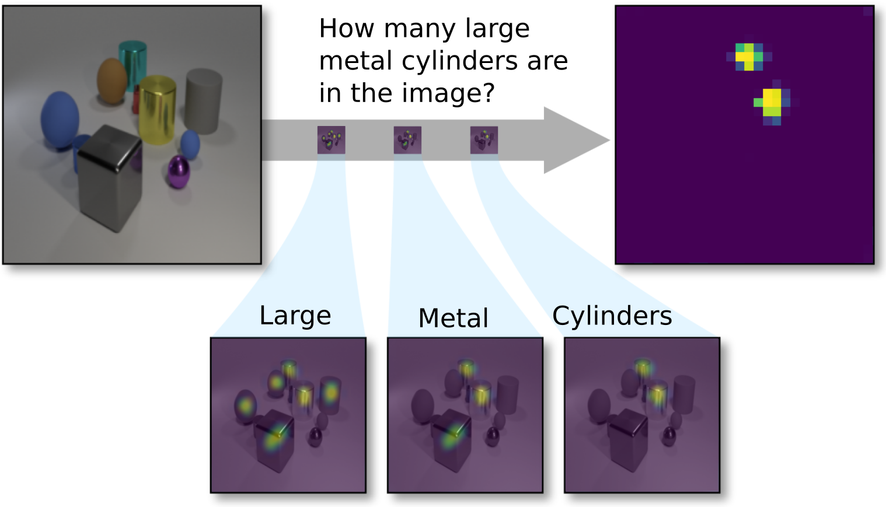

# Transparency-by-Design networks (TbD-nets)
[](https://mybinder.org/v2/gh/davidmascharka/tbd-nets/binder?filepath=full-vqa-example.ipynb)


This repository contains code for replicating the experiments and visualizations from the paper

[Transparency by Design: Closing the Gap Between Performance and Interpretability in Visual
Reasoning](https://arxiv.org/abs/1803.05268)
>[David Mascharka](https://davidmascharka.com), [Philip Tran](https://github.com/ptran516), [Ryan Soklaski](https://github.com/rsokl), Arjun Majumdar <br>

The paper describes Transparency-by-Design networks (TbD-nets), which are built around a visual
attention mechanism. This repository contains the model architecture put forward in the paper and
code that will allow you to

- [Produce the visualizations from the paper](#recreating-our-visualizations)
- [Ask a natural-language question about an image you provide](#full-vqa)
- [Train a model from scratch on the CLEVR dataset](#training-a-model)
- [Predict answers on the CLEVR test set](#testing-a-model)

A visualization of the output produced by our TbD-net model can be seen below.

<div align="center">
    
</div>

If you find this code useful in your research, please cite

``` tex
@InProceedings{Mascharka_2018_CVPR,
author = {Mascharka, David and Tran, Philip and Soklaski, Ryan and Majumdar, Arjun},
title = {Transparency by Design: Closing the Gap Between Performance and Interpretability in Visual Reasoning},
booktitle = {The IEEE Conference on Computer Vision and Pattern Recognition (CVPR)},
month = {June},
year = {2018}
} 
```

# Full VQA
To ask a natural-language question and provide an image to the model and get an answer and reasoning
chain back, see the [full VQA example notebook](full-vqa-example.ipynb). This will define all the
machinery you need to perform the full VQA task and will allow you to download the necessary models.
[Try it with Binder!](https://mybinder.org/v2/gh/davidmascharka/tbd-nets/binder?filepath=full-vqa-example.ipynb)

# Recreating Our Visualizations
You can [use Binder to use our model without any setup!](https://mybinder.org/v2/gh/davidmascharka/tbd-nets/binder?filepath=visualize-output.ipynb)

To reproduce our work on your local machine, you'll need to clone this repository and [set up
PyTorch](#pytorch). We also recommend using [CUDA and cuDNN](#cudacudnn) if you have a GPU
available.

You can then open up the [visualize-output notebook](visualize-output.ipynb). That will walk you
through running our model and generates all the figures we use in our paper. It will also download
one of our pretrained models. From there, you can play around with the images we provide without
having to download any outside data or models. If you would like to experiment with our other
models, see the [downloading models section](#downloading-models).

# Training a Model
To train a model from scratch, there are a few requirements to take care of. We assume you have
already [set up PyTorch](#pytorch) and [CUDA/cuDNN](#cudacudnn) if you plan on using a GPU (which is
highly recommended).

### 1. Getting data
The CLEVR dataset is available at [its project page](http://cs.stanford.edu/people/jcjohns/clevr/).
The first step for training is to download that data.

You will also need to extract features and process the question files to produce programs before
training a model. The [instructions
here](https://github.com/facebookresearch/clevr-iep/blob/master/TRAINING.md#preprocessing-clevr)
provide a method for this. We recommend cloning that repository and following those instructions.

NOTE: to extract 28x28 features, you will need to add the `--model_stage 2` option to the
`extract_features.py` command. Following the conventions on that page, the command you want is:

``` shell
python scripts/extract_features.py \
    --input_image_dir data/CLEVR_v1.0/images/train \
    --output_h5_file data/train_features.h5 \
    --model_stage 2
```

If you want to train on the 14x14 feature maps, you can follow Justin's instructions exactly.

After you have finished the above, you will have several HDF5 files containing the image features
and questions, and a vocabulary file. While we do provide a `DataLoader` that will work with the
HDF5 files, we personally find NumPy npy files more robust and generally more pleasant to work with,
so we default to using those.

##### a. Converting HDF5 to npy
Note that this step is completely optional. The [h5_to_np script](utils/h5_to_np.py) will produce
npy files from your HDF5 files.

Note that the largest NumPy data file (train_features.npy) is 53 gigabytes for the 14x14 feature
maps or 105 gigabytes for the 28x28 feature maps, meaning you will need a substantial amount of RAM
available on your machine to create these files. *If you do not have enough memory available, use
the HDF5 data loader instead of trying to convert these files.*

To convert your HDF5 files to npy files, invoke one of the following, depending on whether you want
to convert images to NumPy format as well:

``` shell
python h5_to_np -q /path/to/questions.h5 -f /path/to/features.h5 -i /path/to/images.h5 -d /path/to/dest/
python h5_to_np -q /path/to/questions.h5 -f /path/to/features.h5 -d /path/to/destination/
```

### 2. Training the model
The [train-model notebook](train-model.ipynb) will then walk through the training process. Our
recommended directory structure (which is shown in the notebook) is to create a symlink to your data
files inside the `data` folder. This can be done via:

``` shell
ln -s /path/to/the/data/train_questions.npy data/training/
ln -s /path/to/the/data/train_image_idxs.npy data/training/
# etc
```

for data in npy format, or via:

``` shell
ln -s /path/to/the/data/train_features.h5 data/training/
ln -s /path/to/the/data/train_questions.h5 data/training/
# likewise for validation
```

for data in HDF5 format.

If you prefer a different directory structure, update the data loader paths in the notebook. The
notebook will walk through training a model from this point.

# Testing a Model
Note that the testing data does not provide ground truth programs, so we will need to generate
programs from the questions for testing. We do not focus on this component of the network in our
work, so we reuse the program generator from [Johnson *et
al.*](https://github.com/facebookresearch/clevr-iep) We have repackaged the sequence-to-sequence
model they use for this, removing unnecessary functionality and updating the code to run on PyTorch
versions later than 0.1. We provide a model checkpoint that we trained ourselves, so you don't need
to download and use their model. The [test-eval notebook](test-eval.ipynb) will download our program
generation model and walk through the process to produce a file containing the predicted test
answers.

# Notes
### Downloading Models
Tod download models, you can use the `download_pretrained_models.py` script, or download them
programmatically as we do in the visualize output and full VQA notebooks.

There are several pretrained models available. If you would like to play with a specific model from
the table of results in the paper, you certainly can. *However*, we only provide extracted features
for the model trained on 28x28 feature maps, so if you want to use the 14x14 feature maps you'll
need to extract those features yourself. See [the getting data section](#1-getting-data) for details
on that. The download options for the script are:

``` shell
python utils/download_pretrained_models.py -m original
python utils/download_pretrained_models.py -m reg
python utils/download_pretrained_models.py -m hres
python utils/download_pretrained_models.py -m all
```

The default is `hres` which downloads only the models trained with higher-resolution 28x28 feature
maps and the regularization factor (see paper text for details). This results in cleaner looking
attention masks, state-of-the-art performance, and is recommended. If you want to replicate the
other results in the table, `original` will give only the models trained without regularization on
14x14 feature maps, `reg` will download the models trained with regularization on 14x14 feature
maps, and `all` will download everything.

### Python
We only recommend running the code with Python 3, having done all our development using Python
3.6. While the code may be coerced into running in Python 2, *we will not support Python 2*, so please do not open
issues that are related to Python 2 support.

### PyTorch
Our development was done using PyTorch v0.1.12, v0.2.0, and v0.3.0 and has been tested with v0.4. As such, our code
should run even on PyTorch versions earlier than 0.2 without modifications. However, we do recommend running on PyTorch 
0.2.0 or later. For setting up PyTorch, see the [official installation instructions](https://github.com/pytorch/pytorch#installation). The specific hash that the original model from our paper was developed from is
[here](https://github.com/pytorch/pytorch/tree/d9b89a352c4ceeff24878f4f5321e16f059e98c3).

To use PyTorch <0.4, clone the repository and check out `tags/torchv0.3`. For PyTorch 0.4 and above, `master` will run.

### CUDA/cuDNN
Our code is tested under CUDA 8 and CUDA 9 with cuDNN 5 and cuDNN 7, respectively. For setting up
CUDA, see the [NVIDIA documentation](https://developer.nvidia.com/cuda-toolkit). We recommend using
cuDNN, which is also available [from NVIDIA](https://developer.nvidia.com/cudnn).

### Operating Systems
Our development was done on CentOS 6 and Ubuntu 16.04. The code has also been tested under Arch
Linux.

### Setting up a conda environment
If you like, you can use the `environment.yml` configuration to set up a development environment if
you use `conda`. This is the environment that Binder uses to give a live notebook for the
visualizations. To create an environment using this, run

``` shell
conda env create -f environment.yml
```

The environment can then be activated with `source activate tbd-env`.

# Copyright
DISTRIBUTION STATEMENT A. Approved for public release: distribution unlimited.

This material is based upon work supported by the Assistant Secretary of Defense for Research and
Engineering under Air Force Contract No. FA8721-05-C-0002 and/or FA8702-15-D-0001. Any opinions,
findings, conclusions or recommendations expressed in this material are those of the author(s) and
do not necessarily reflect the views of the Assistant Secretary of Defense for Research and
Engineering.

© 2017 Massachusetts Institute of Technology.

MIT Proprietary, Subject to FAR52.227-11 Patent Rights - Ownership by the contractor (May 2014)

The software/firmware is provided to you on an As-Is basis

Delivered to the U.S. Government with Unlimited Rights, as defined in DFARS Part 252.227-7013 or
7014 (Feb 2014). Notwithstanding any copyright notice, U.S. Government rights in this work are
defined by DFARS 252.227-7013 or DFARS 252.227-7014 as detailed above. Use of this work other than
as specifically authorized by the U.S. Government may violate any copyrights that exist in this
work.
